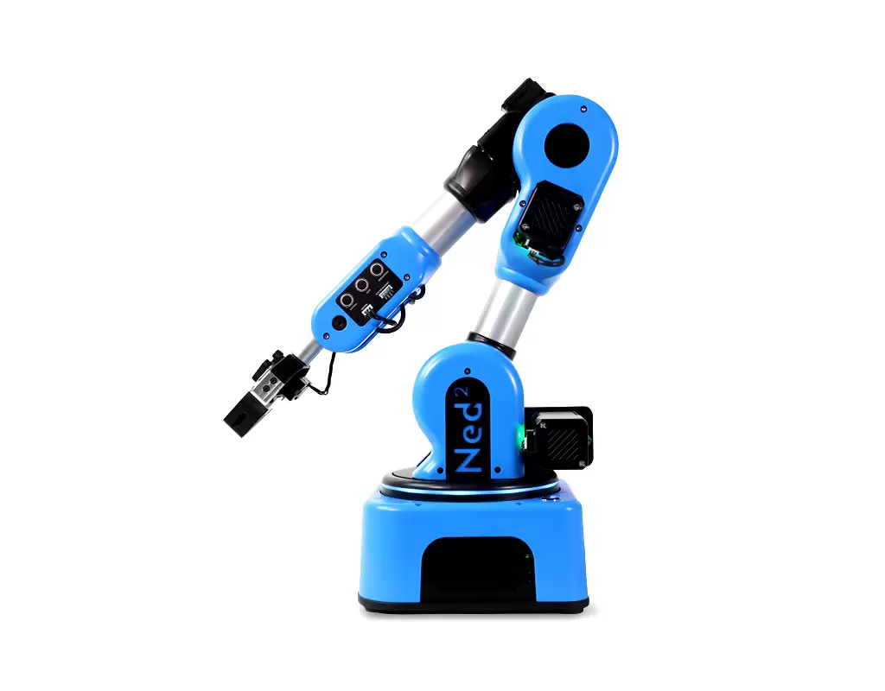
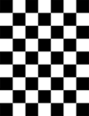
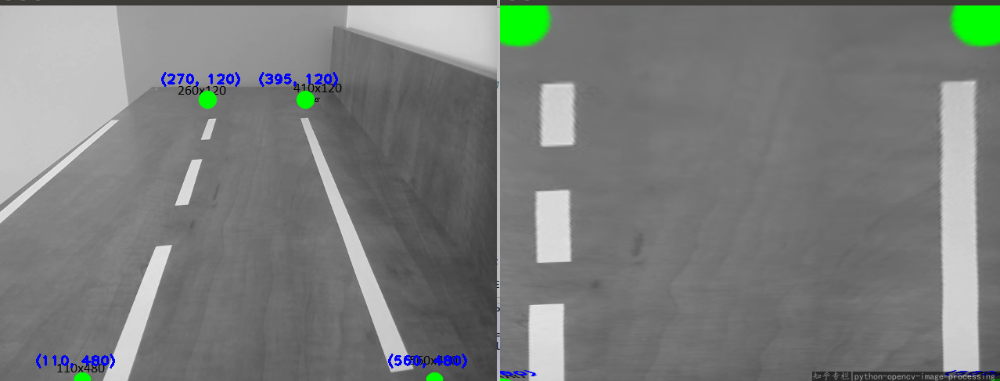
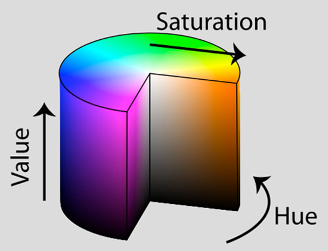
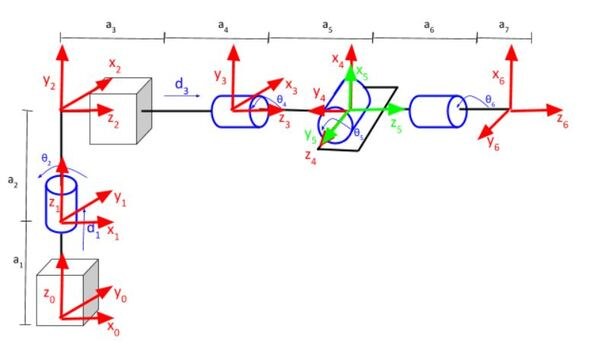
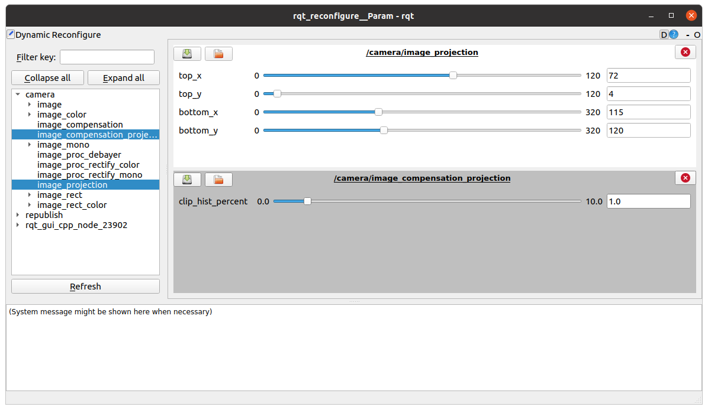
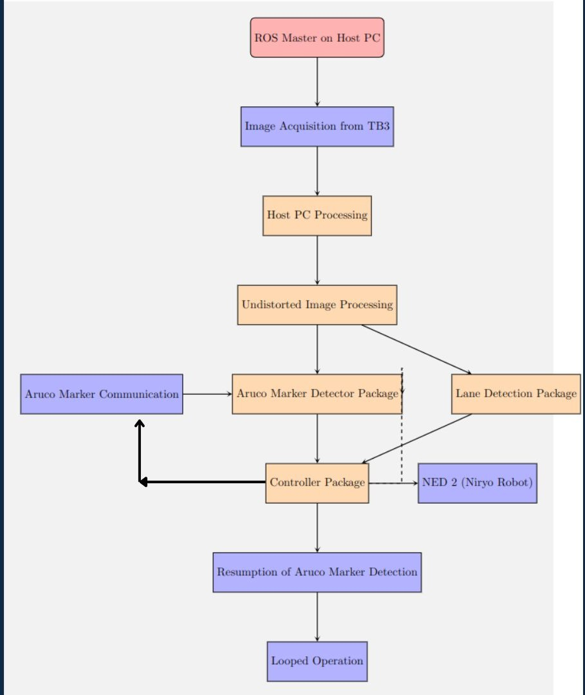

# Robotics Project

* Authors: 
    1. Khizar Zaar
    2. Ali Haidar Ahmad

* Instructor:
    1. Dr Jouquin
    2. Ralph


- [Robotics Project](#robotics-project)
- [1. Introduction](#1-introduction)
  - [1.1. Objective](#11-objective)
- [2. Methodology](#2-methodology)
  - [2.1. Image acquisition](#21-image-acquisition)
  - [2.2. Camera calibration](#22-camera-calibration)
  - [2.3. Camera Calibration with Respect to the Fish-eye Camera](#23-camera-calibration-with-respect-to-the-fish-eye-camera)
  - [2.4. Intrinsic calibration](#24-intrinsic-calibration)
    - [2.4.1. General Model](#241-general-model)
    - [2.4.2. Radial Distortion Model](#242-radial-distortion-model)
    - [2.4.3. Tangential Distortion Model](#243-tangential-distortion-model)
    - [2.4.4. Adapting for Fish-eye Camera](#244-adapting-for-fish-eye-camera)
  - [2.5. Extrinsic calibration](#25-extrinsic-calibration)
    - [2.5.1. Extrinsic Calibration for Fish-eye Camera](#251-extrinsic-calibration-for-fish-eye-camera)
    - [2.5.2. Mathematical Model](#252-mathematical-model)
    - [2.5.3. Adaptation for Fish-eye Camera](#253-adaptation-for-fish-eye-camera)
  - [2.6. Bird Eye View](#26-bird-eye-view)
    - [2.6.1. Mathematical Model](#261-mathematical-model)
      - [2.6.1.1. Transformation Matrix](#2611-transformation-matrix)
      - [2.6.1.2. Homogeneous Coordinates](#2612-homogeneous-coordinates)
      - [2.6.1.3. Perspective Transformation](#2613-perspective-transformation)
    - [2.6.2. Adapting for Fish-eye Camera](#262-adapting-for-fish-eye-camera)
      - [2.6.2.1. Radial Distortion Correction](#2621-radial-distortion-correction)
      - [2.6.2.2. Perspective Transformation for Fish-eye](#2622-perspective-transformation-for-fish-eye)
  - [2.7. Lane detection](#27-lane-detection)
    - [2.7.1. **Color Space Conversion**](#271-color-space-conversion)
    - [2.7.2. **Thresholding:**](#272-thresholding)
    - [2.7.3. **Adaptive Calibration**](#273-adaptive-calibration)
    - [2.7.4. **Counting Short Lines**](#274-counting-short-lines)
    - [2.7.5. **Lane fitting**](#275-lane-fitting)
      - [2.7.5.1. Methodology](#2751-methodology)
      - [2.7.5.2. Mathematical Model](#2752-mathematical-model)
  - [2.8. Aruco Marker detection](#28-aruco-marker-detection)
    - [2.8.1. How Aruco Markers Work](#281-how-aruco-markers-work)
    - [2.8.2. Mathematical Model for Aruco Marker Detection](#282-mathematical-model-for-aruco-marker-detection)
    - [2.8.3. Unique Identifier Extraction](#283-unique-identifier-extraction)
  - [2.9. Distance from aruco marker](#29-distance-from-aruco-marker)
    - [2.9.1. Mathematical Model](#291-mathematical-model)
    - [2.9.2. Projection Matrix](#292-projection-matrix)
    - [2.9.3. Homogeneous Coordinates](#293-homogeneous-coordinates)
    - [2.9.4. Distance Calculation](#294-distance-calculation)
  - [2.10. Controller](#210-controller)
    - [2.10.1. PD Controller in Robotics](#2101-pd-controller-in-robotics)
    - [2.10.2. Using PD Controller for Robot Movement](#2102-using-pd-controller-for-robot-movement)
  - [2.11. Stopping](#211-stopping)
  - [2.12. Niryo robot pick and place](#212-niryo-robot-pick-and-place)
- [3. Implementation](#3-implementation)
  - [3.1. ROS](#31-ros)
    - [3.1.1. Setting Up ROS Master-Slave Configuration](#311-setting-up-ros-master-slave-configuration)
  - [3.2. Turtlebot 3 setup](#32-turtlebot-3-setup)
  - [3.3. Image acquisition and Camera Calibration](#33-image-acquisition-and-camera-calibration)
    - [3.3.1. Intrinsic Calibration](#331-intrinsic-calibration)
    - [3.3.2. Extrinsic Calibration](#332-extrinsic-calibration)
  - [3.4. Aruco Marker detection and distance calculation](#34-aruco-marker-detection-and-distance-calculation)
    - [3.4.1. Aruco marker detection](#341-aruco-marker-detection)
    - [3.4.2. Aruco marker Pose Estimation](#342-aruco-marker-pose-estimation)
    - [3.4.3. Distance between the Aruco marker and TB3](#343-distance-between-the-aruco-marker-and-tb3)
  - [3.5. Lane Detection](#35-lane-detection)
  - [3.6. Controller](#36-controller)
  - [3.7. NED 2 pick and place](#37-ned-2-pick-and-place)
  - [3.8. Project Integration and Workflow Overview](#38-project-integration-and-workflow-overview)
- [4. Results](#4-results)
  - [4.1. Camera Calibration](#41-camera-calibration)
  - [4.2. Lane detection](#42-lane-detection)
  - [4.3. Aruco detection and distance](#43-aruco-detection-and-distance)
  - [4.4. Robot stopping](#44-robot-stopping)
  - [4.5. TB3 lane following and Niryo pick and place](#45-tb3-lane-following-and-niryo-pick-and-place)
- [5. Future work](#5-future-work)
- [6. Conclusion](#6-conclusion)


# 1. Introduction

Robotics has emerged as an indispensable component of the contemporary technological landscape. The amalgamation of computer vision and robotics has bestowed upon us the capability to execute a myriad of tasks. The present project stands as a noteworthy illustration of the fusion of vision and robotics, exemplifying the synergistic potential of these technologies.

## 1.1. Objective

The primary aim of this research project is to facilitate the capacity of a ground robot in detecting and adhering to lanes, halting in close proximity to a manipulator robot. This pause in movement is intended to enable the manipulator robot to conduct the task of picking up and placing an object onto the ground robot, following which the ground robot resumes its lane-following operations. This experimental setup serves as a prototype, simulating the functions of a warehousing robot system wherein the ground robot is assigned the responsibility of transporting objects between specified locations.

The ground robot employed in this research is the [Turtlebot 3](https://emanual.robotis.com/docs/en/platform/turtlebot3/overview/), outfitted with a camera, 
while the manipulator component utilizes the [Niryo NED 2](https://niryo.com/products-cobots/robot-ned-2/) 
 and the circuit we are using is the autoRace circuit.


The AutoRace circuit incorporates a variety of distinctive features, including straights, curves, turns, and tunnels. These elements collectively provide a platform that enables us to accurately simulate real-world conditions for experimental purposes.

Given the multifaceted nature of this project, a modular approach has been adopted for its execution. The delineated tasks are as follows:

1. Image acquisition from the Turtlebot 3 (TB3).
2. Detection of Aruco Markers.
3. Lane detection.
4. TB3 movement.
5. Pick and place operations using the Niryo NED 2.

# 2. Methodology
In this section, we will elucidate the theoretical framework employed in this project. Each facet of the project is expounded upon in its respective section below.

## 2.1. Image acquisition

Image acquisition refers to the process of capturing visual data, typically in the form of photographs or frames, using a device such as a camera or sensor. This stage involves the conversion of real-world scenes into digital representations, laying the foundation for subsequent analysis, processing, and interpretation in various applications, including computer vision and image processing.

For our project, we have opted to utilize a fish-eye camera, characterized by its wide-angle lens that captures a panoramic and notably distorted view of the scene.
](<Images/fish eye camera.jpg>)

In contrast to conventional cameras with rectilinear lenses, fish-eye lenses introduce considerable barrel distortion, causing straight lines to appear curved, particularly near the image edges. This distortion arises from the lens projecting a hemispherical image onto a flat sensor.

 

Fisheye cameras find common applications in panoramic photography and scenarios requiring an extensive field of view, such as our case. The distinctive radial distortion in fisheye images manifests as increased distortion toward the periphery, contrasting with objects nearer to the center. Calibration techniques are frequently employed to rectify fisheye distortion, ensuring precision in image analysis across diverse applications.


## 2.2. Camera calibration

Camera calibration is a crucial process in computer vision and image processing, aiming to determine the intrinsic and extrinsic parameters of a camera system. Intrinsic parameters include focal length, optical center, and lens distortion, while extrinsic parameters encompass the camera's position and orientation in the 3D world. Calibration ensures accurate mapping between the 3D world coordinates and the 2D image coordinates, facilitating precise measurement and analysis in applications.

## 2.3. Camera Calibration with Respect to the Fish-eye Camera

Calibrating a fish-eye camera typically includes capturing images of a known calibration pattern from various angles and orientations. The distorted images captured by the fish-eye lens are then used to estimate the lens distortion parameters, allowing subsequent correction and accurate mapping of image coordinates to real-world coordinates. The calibration process ensures that measurements and analyses conducted using the fish-eye camera yield precise and undistorted results, enhancing the reliability of applications.

## 2.4. Intrinsic calibration

Intrinsic camera calibration is the process of determining the internal parameters of a camera that are inherent to its optical system. These parameters include:

1. **Focal Length (f)**: The distance from the camera's optical center to the image sensor. It influences how much the scene is magnified and affects the field of view.

2. **Principal Point (c)**: The coordinates of the image center, representing the point where the optical axis intersects the image plane. It is usually denoted as (cx, cy).

3. **Lens Distortion Coefficients**: Parameters that correct for imperfections in the lens, such as radial distortion and tangential distortion.

Intrinsic camera calibration is crucial because it helps correct distortions in images, allowing for accurate mapping of pixel coordinates to real-world measurements. Calibration is typically performed using a calibration pattern with known geometric properties, such as a checkerboard or a grid. We used a checkerboard for the calibration




### 2.4.1. General Model

The general intrinsic camera calibration model comprises two main distortion components: radial distortion typically modeled using the [Brown-Conrady distortion model](https://www.foamcoreprint.com/blog/what-are-calibration-targets) and tangential distortion. 

### 2.4.2. Radial Distortion Model

Radial distortion is typically modeled using the following equation:

$$ r_{\text{corrected}} = r \cdot (1 + k_1 \cdot r^2 + k_2 \cdot r^4 + k_3 \cdot r^6) $$

Where:
- $ \left( r \right) $ is the radial distance from the optical center to a point in the distorted image.
- $\left( k_1, k_2, k_3 \right)$ are the radial distortion coefficients.

### 2.4.3. Tangential Distortion Model

Tangential distortion correction is applied as follows:

$$ x_{\text{corrected}} = x + (2 \cdot p_1 \cdot x \cdot y + p_2 \cdot (r^2 + 2 \cdot x^2))$$
$$ y_{\text{corrected}} = y + (p_1 \cdot (r^2 + 2 \cdot y^2) + 2 \cdot p_2 \cdot x \cdot y) $$

Where:
- $( x, y )$ are the coordinates in the distorted image.
- $( p_1, p_2 )$ are the tangential distortion coefficients.

### 2.4.4. Adapting for Fish-eye Camera

For fish-eye cameras, OpenCV employs a specific fisheye camera model. The radial distortion equation is extended to include additional higher-order terms:

$$ r_{\text{corrected}} = r \cdot (1 + k_1 \cdot r^2 + k_2 \cdot r^4 + k_3 \cdot r^6 + k_4 \cdot r^8) $$

Where:
- $( k_1, k_2, k_3, k_4)$ are the radial distortion coefficients specific to the fisheye model.

The tangential distortion correction remains the same.

These equations represent the intrinsic camera calibration model and its adaptation for a fish-eye camera, as implemented in the [OpenCV library](https://docs.opencv.org/4.x/db/d58/group__calib3d__fisheye.html).

## 2.5. Extrinsic calibration

Extrinsic camera calibration is a fundamental process in computer vision that involves determining the spatial relationship between a camera and the external world. It focuses on estimating the camera's position and orientation in a defined coordinate system, enabling accurate mapping between the 3D world and 2D image coordinates.

### 2.5.1. Extrinsic Calibration for Fish-eye Camera

For a fish-eye camera, extrinsic calibration becomes particularly important due to the unique distortion characteristics of fish-eye lenses. Fish-eye lenses introduce significant radial distortion, impacting the projection of 3D points onto the 2D image plane.

### 2.5.2. Mathematical Model

The extrinsic calibration parameters include the rotation matrix $(R)$ and translation vector $( t )$ representing the camera's position and orientation. The projection of a 3D point $( P )$ in the world coordinates to its 2D image coordinates $(p)$ can be expressed as:

$$ p = K \cdot [R \mid t] \cdot P$$

Where:
- $( K )$ is the intrinsic camera matrix.
- $( R )$ is the rotation matrix.
- $( t )$ is the translation vector.

### 2.5.3. Adaptation for Fish-eye Camera

For fish-eye cameras, the intrinsic calibration parameters obtained previously must be considered to account for radial distortion. The projection equation is modified to include radial distortion correction:

$$ p = K \cdot [R \mid t] \cdot D \cdot P$$

Where:
- $( D )$ is the radial distortion correction matrix, typically derived from the camera's intrinsic calibration.

## 2.6. Bird Eye View

Bird’s eye view, in the context of computer vision, refers to a top-down perspective of a scene or an object. It provides a flattened, orthogonal view, simulating the perspective one would have when looking directly down from above. This view is valuable in various applications, such as our case where we want to detect the lanes on the circuit. Since the camera is located at a height facing forward with respect to the circuit, we want to see and detect lanes.



After performing camera calibration (intrinsic and extrinsic), obtaining a bird’s eye view involves mapping the distorted image coordinates to undistorted world coordinates. This process typically includes:

1. **Define a Transformation Matrix:** Derive a transformation matrix using the camera's intrinsic and extrinsic calibration parameters.

2. **Undistort Image:** Apply the transformation matrix to undistort the input image and correct for lens distortions.

3. **Perspective Transformation:** Perform a perspective transformation to convert the undistorted image into a bird’s eye view. This transformation involves mapping the points from the camera's perspective to a flat, top-down view.

### 2.6.1. Mathematical Model

#### 2.6.1.1. Transformation Matrix

The transformation matrix $(M)$ for perspective transformation can be defined as:

$$ \begin{bmatrix} X' \\\ Y' \\\ W' \end{bmatrix} = M \cdot \begin{bmatrix} X \\\ Y \\\ Z \end{bmatrix} $$

Where:
- $(X, Y, Z)$ are the 3D world coordinates.
- $(X', Y', W')$ are the transformed 2D image coordinates.

The transformation matrix $(M)$ is typically obtained using the intrinsic and extrinsic camera calibration parameters.

#### 2.6.1.2. Homogeneous Coordinates

Homogeneous coordinates are used to represent points in 2D and 3D space. The transformed coordinates $(X', Y', W')$ can be converted back to Cartesian coordinates $(x', y')$ using:

$$ x' = \frac{X'}{W'} $$
$$ y' = \frac{Y'}{W'} $$

#### 2.6.1.3. Perspective Transformation

The perspective transformation equations for a bird’s eye view involve mapping the 3D world coordinates $(X, Y, Z)$ to 2D image coordinates $(x', y')$ using the transformation matrix $(M)$.


### 2.6.2. Adapting for Fish-eye Camera

Adapting bird’s eye view generation for a fish-eye camera involves considering the unique distortion characteristics of fish-eye lenses. The radial distortion correction obtained during fish-eye camera calibration is crucial for accurate perspective transformation.

The process includes:

1. **Incorporate Radial Distortion Correction:** Utilize the radial distortion correction matrix obtained during fish-eye camera calibration to ensure accurate undistortion.

2. **Perspective Transformation for Fish-eye:** Adjust the perspective transformation process to account for the specific geometric properties of fish-eye images, ensuring a precise bird’s eye view despite the radial distortion.

#### 2.6.2.1. Radial Distortion Correction

For fish-eye cameras, radial distortion correction must be incorporated into the transformation process. The corrected coordinates $(x_{\text{corrected}}, y_{\text{corrected}})$ are obtained by applying the radial distortion correction matrix $(D)$ from the intrinsic calibration:

$$ \begin{bmatrix} x_{\text{corrected}} \\\ y_{\text{corrected}} \end{bmatrix} = D \cdot \begin{bmatrix} x' \\\ y' \end{bmatrix} $$

#### 2.6.2.2. Perspective Transformation for Fish-eye

The perspective transformation for a fish-eye camera is adjusted to consider the radial distortion-corrected coordinates. The equations for transforming the 3D world coordinates $(X, Y, Z)$ to the corrected 2D image coordinates $(x_{\text{corrected}}, y_{\text{corrected}})$ involve using the modified transformation matrix $M_{\text{corrected}}$:

$$ \begin{bmatrix} x_{\text{corrected}} \\\ y_{\text{corrected}} \\\ W' \end{bmatrix} = M_{\text{corrected}} \cdot \begin{bmatrix} X \\\ Y \\\ Z \end{bmatrix} $$

Where $M_{\text{corrected}}$ incorporates both the original transformation matrix and the radial distortion correction matrix.

## 2.7. Lane detection


Lane detection is a fundamental task in computer vision that involves identifying and delineating the lanes or road markings in an image or video stream. The primary objective is to locate the boundaries of lanes, providing crucial information for autonomous vehicles, driver assistance systems, and traffic monitoring applications. In our case, the circuit has two boundary lanes i.e., yellow and white and our aim is to detect both these lanes for our robot to move autonomously in between these lanes. 

The steps taken for lane detection are:

### 2.7.1. **Color Space Conversion**
Converting the input image from the BGR (Blue, Green, Red) color space to the HSV (Hue, Saturation, Value) color space offers several advantages for lane detection:

1. **Separation of Luminance and Color Information:**
   - The HSV color space separates luminance (brightness) information from color information, allowing more effective extraction of color-based features, such as lane markings.

2. **Simplified Thresholding**
   - Thresholding in the HSV space is more intuitive and simplified, especially for tasks like detecting specific colors. For lane detection, this facilitates the isolation of white and yellow lane markings through straightforward thresholding.

3. **Robustness to Illumination Variations**
   - HSV is less sensitive to variations in lighting conditions compared to the RGB or BGR color spaces. This robustness is crucial for maintaining lane detection accuracy across different lighting scenarios.

4. **Enhanced Adaptability**
   - The Hue channel in HSV represents color information, making it easier to adaptively calibrate the lane detection algorithm based on changes in lighting and road conditions.

5. **Improved Lane Discrimination**
   - By focusing on the Saturation and Value channels, the algorithm can better discriminate between different lane markings, especially under challenging lighting conditions.

The conversion to the HSV color space enhances the lane detection process by providing a more intuitive representation of color information, improved adaptability to varying lighting conditions, and simplified thresholding for effective feature extraction.



The conversion from the BGR (Blue, Green, Red) color space to the HSV (Hue, Saturation, Value) color space involves the following mathematical transformations:

Let $( B, G, R )$ represent the Blue, Green, and Red channels of a pixel in the BGR color space, respectively. Similarly, let $( H, S, V )$ represent the Hue, Saturation, and Value channels in the HSV color space, respectively.

The conversion equations are as follows:

1. **Normalization**:

Normalize the BGR values to the range $[0, 1]$:
$$ b = \frac{B}{255}, \quad g = \frac{G}{255}, \quad r = \frac{R}{255} $$

2. **Compute Value** **(V)**:

$$ V = \max(b, g, r)$$

3. **Compute Saturation (S)**:

$$ S = \begin{cases} 
0 & \text{if } V = 0 \\
\frac{V - \min(b, g, r)}{V} & \text{otherwise}
\end{cases} $$

4. **Compute Hue (H)**:

$$ H = \begin{cases} 
0 & \text{if } V = 0 \\
60 \times \left( \frac{g - b}{V - \min(b, g, r)} \mod 6 \right) & \text{if } V = r \\
60 \times \left( \frac{b - r}{V - \min(b, g, r)} + 2 \right) & \text{if } V = g \\
60 \times \left( \frac{r - g}{V - \min(b, g, r)} + 4 \right) & \text{if } V = b \\
\end{cases} $$

### 2.7.2. **Thresholding:**
1. Establish a range within the HSV color space to identify both white and yellow lane markings separately.
2. Employ thresholding, separately, on the HSV image to generate a binary mask that isolates white and yellow lane markings.

### 2.7.3. **Adaptive Calibration**

Adaptive Calibration, in the context of white and yellow lane detection, involves dynamically adjusting the lightness parameter based on the fraction of white or yellow pixels in the image. This process aims to optimize the lane detection algorithm by fine-tuning the sensitivity to lane markings.

1. If the fraction of pixels is too high, indicating potentially overexposed or strongly illuminated areas, the lightness parameter is decreased. This adjustment helps prevent over-saturation and ensures that the algorithm remains effective in identifying lane markings under varying lighting conditions.

2. Conversely, if the fraction of pixels is too low, suggesting insufficient illumination or contrast, the lightness parameter is increased. This adaptation enhances the algorithm's ability to detect faint or less distinct lane markings, promoting robust performance across diverse lighting scenarios.

Adaptive Calibration optimizes the lane detection algorithm's sensitivity to lane markings by dynamically modifying the lightness parameter. This adaptive approach contributes to the algorithm's resilience in different lighting conditions, ultimately improving the accuracy and reliability of lane detection.


### 2.7.4. **Counting Short Lines**

Counting Short Lines, within the context of lane detection, involves assessing the number of short lines detected in the lower part of the image. The objective is to gauge the prominence and clarity of lane markings, particularly in regions closer to the vehicle.

After counting these short lines, the reliability of the detected white lane is adjusted based on this count. If a substantial number of short lines are identified, it indicates a higher likelihood of well-defined and visible lane markings. Consequently, the reliability of the detected white lane is increased, signifying greater confidence in the accuracy of the lane detection algorithm for markings.

This adaptive adjustment based on the count of short lines contributes to the robustness of the lane detection system, allowing it to dynamically adapt to variations in road conditions and visibility.


### 2.7.5. **Lane fitting**

Lane fitting involves the application of a second-order polynomial fit to the detected lane pixels, employing either a sliding window or line-based filtering approach. This process aims to model the shape of the lane markings, providing a mathematical representation that facilitates lane tracking.

#### 2.7.5.1. Methodology

**Sliding Window Approach:**
   - Divides the image into vertical slices and identifies the lane pixels within each slice.
   - Utilizes a sliding window to iteratively reposition and identify pixels along the lane.
   - Applies a polynomial fit to the identified pixels, generating a smooth curve representing the lane.

#### 2.7.5.2. Mathematical Model

The second-order polynomial fit is represented by the equation:

$$ f(y) = Ay^2 + By + C $$

Here, $f(y)$ corresponds to the x-coordinate of the lane at a given y-coordinate. The coefficients $A, B,$ and $C$ are determined a curve-fitting process, commonly using methods like the least-squares fit. The sliding window technique involves identifying lane pixels within localized regions, creating a histogram, and then fitting the polynomial to these pixels.

This process contributes to the robustness of lane detection algorithms, allowing for accurate and continuous modeling of lane markings in various driving scenarios.

## 2.8. Aruco Marker detection

The [Aruco Marker](https://docs.opencv.org/4.x/d5/dae/tutorial_aruco_detection.html) serves as a binary square fiducial marker specifically crafted for computer vision applications, with prevalent usage in tasks such as camera calibration and pose estimation. Characterized by a grid of black and white squares, Aruco markers encode information within their distinct patterns. 


Leveraging its capabilities for pose estimation, we can determine the distance between the camera and the Aruco marker. In our application, we employ an Aruco marker to facilitate the precise stopping of the TB3 at a predefined distance from the NED2.


### 2.8.1. How Aruco Markers Work
1. **Pattern Encoding**
    Aruco markers encode information in their binary pattern, typically comprising a unique identifier that distinguishes one marker from another.

2. **Grid Structure**

- The marker is structured as a square grid with a border, ensuring easy detection and identification.
Rotation and Translation Invariance:

- Aruco markers are designed to be rotation and translation invariant, allowing robust detection even when the marker undergoes changes in orientation or position.

3. **Aruco Marker Detection**
Detection of Aruco markers involves the following steps:

    - **Image Capture:**

        - Acquire an image or video frame containing the scene with Aruco markers using a camera. We already have th images coming from the TB3

    - **Image Processing:**

        - Convert the image to grayscale better marker visibility.

    - **Marker Detection Algorithm:**

        - Utilize computer vision algorithms, often based on corner detection and pattern recognition techniques, to identify the location and orientation of Aruco markers in the image.

### 2.8.2. Mathematical Model for Aruco Marker Detection
The mathematical model for Aruco marker detection involves:

1. **Corner Detection**

    - Use corner detection algorithms (e.g., Harris corner detection) to identify key points in the image.

2. **Pattern Matching**

    - Apply pattern matching techniques to match the detected corners with the expected Aruco marker patterns.

3. **Pose Estimation**

    - Use the known dimensions of the Aruco marker and the detected corners to estimate the pose (position and orientation) of the marker in 3D space.

### 2.8.3. Unique Identifier Extraction

Extract the unique identifier encoded in the marker's pattern for identification.


A combination of geometric principles, image processing algorithms, and pattern recognition is employed to achieve accurate Aruco marker detection. The OpenCV library provides functionalities for Aruco marker detection, making it a widely used tool in computer vision applications.

## 2.9. Distance from aruco marker

To calculate the distance from an Aruco marker to the camera using camera calibration: $K$, distortion coefficients, and $rvec$ and $tvec$ which we obtain from calculating the pose.

### 2.9.1. Mathematical Model

The relationship between 3D world coordinates and 2D image coordinates is given by:

$$ \begin{bmatrix} u \\\ v \\\ 1 \end{bmatrix} = K \begin{bmatrix} R & t \end{bmatrix} \begin{bmatrix} X \\\ Y \\\ Z \\\ 1 \end{bmatrix} $$

### 2.9.2. Projection Matrix

The camera matrix $K$ is decomposed into the intrinsic matrix:

$K = \begin{bmatrix} f_x & 0 & c_x \\\ 0 & f_y & c_y \\\ 0 & 0 & 1 \end{bmatrix}$

### 2.9.3. Homogeneous Coordinates

Use homogeneous coordinates for simplification: $$ P' = (X, Y, Z, 1)$$

### 2.9.4. Distance Calculation

The distance $d$ from the camera to the 3D point is calculated using the Euclidean norm:

$$ d = \sqrt{X^2 + Y^2 + Z^2}$$

Once we have the distance, we can use this distance to control the movement of the robot.

## 2.10. Controller

In the realm of robotics, a controller refers to a device or a set of algorithms that regulate and manage the behavior of a robot. Its primary purpose is to manipulate the robot's actuators (motors, servos, etc.) to achieve desired movements or behaviors in response to sensory input or commands. There are three controllers and yhe choice of using a P controller, PD controller, or PID controller depends on the specific requirements of the control system and the characteristics of the controlled process.

A P (Proportional) controller is suitable when a proportional response to the error is sufficient, and there is no need to address issues such as steady-state error or system overshoot. A PD (Proportional-Derivative) controller is beneficial when damping oscillations and responding to the rate of change of the error are important, enhancing stability and reducing overshooting. On the other hand, a PID (Proportional-Integral-Derivative) controller is employed when it is necessary to eliminate steady-state error as well, making it a versatile choice for systems with complex dynamics. The PID controller combines proportional, derivative, and integral actions, providing a comprehensive approach to achieving precise and stable control across a wide range of applications. The selection among these controllers is often a trade-off between simplicity and the need for advanced control features, with the specific characteristics of the system and the desired performance dictating the most suitable choice.

In our case, we are using a PD controller to control the movement of TB3. In the realm of controlling the movement of ground robots, opting for a PD (Proportional-Derivative) controller over a PID (Proportional-Integral-Derivative) controller can be advantageous in specific scenarios, taking into account the distinctive characteristics of the system and the intended control response. PD controllers prove to be well-suited when there is a necessity to address challenges such as damping oscillations and responding to the rate of change of the error, both of which contribute to stability and help mitigate overshooting. Given the critical factors of simplicity and swift response times in the context of ground robots, a PD controller provides effective control without introducing the integral term, thereby avoiding potential issues like integrator windup and stability challenges in certain situations. Additionally, in well-defined environments where ground robots operate, the absence of a requirement for integral action to eliminate steady-state error makes the PD controller a more direct and efficient choice for achieving the desired movement control. The ultimate decision between PD and PID controllers hinges on the specific dynamics of the ground robot and the desired balance between simplicity and control performance.

### 2.10.1. PD Controller in Robotics
A Proportional-Derivative (PD) controller is a type of feedback control system commonly used in robotics to regulate the motion of robots. It combines two key elements: proportional control and derivative control. The proportional term is responsible for responding to the current error, while the derivative term addresses the rate of change of the error. Together, they contribute to achieving stable and responsive control in various robotic applications.

**Components of a PD Controller:**

1. **Proportional (P) Term:**

    - Computes a control signal proportional to the current error.
    - The error is the difference between the desired and actual states of the system.

2. **Derivative (D) Term:**

    - Takes into account the rate of change of the error.
    Counteracts rapid changes in the error, promoting stability.

**Contribution to Robotic Control:**

1. **Damping Oscillations:**

    - The derivative term helps in damping oscillations by anticipating and counteracting rapid changes in the error signal. This is particularly useful in preventing overshooting and oscillations in the robot's movements.

2. **Improved Stability:**

    - The combination of proportional and derivative terms enhances the overall stability of the control system. It allows for a rapid response to changes in the environment or disturbances.

3. **Reduced Steady-State Error:**

    - The proportional term ensures that there is a response to any steady-state error (persistent error over time), contributing to accurate and precise control.

### 2.10.2. Using PD Controller for Robot Movement

1. **Define System Dynamics:**
   - Understand the dynamics of the robot and the task requirements.
   - Identify the desired state and the sensors providing feedback.

2. **Formulate the Error Signal:**
   - Calculate the error as the difference between the desired state and the actual state.

3. **PD Controller Equations:**
   - Formulate the PD controller equations:
     $$u(t) = K_p \cdot e(t) + K_d \cdot \frac{de(t)}{dt} $$
   - Where:
     - $u(t)$ is the control signal.
     - $K_p$ is the proportional gain.
     - $K_d$ is the derivative gain.
     - $e(t)$ is the error at time $t$.
     - $\frac{de(t)}{dt}$ is the rate of change of the error.

4. **Tune Controller Parameters:**
   - Experimentally tune the proportional and derivative gains to achieve the desired system response.
   - Adjust gains to balance between responsiveness and stability.

5. **Implementation:**
   - Integrate the PD controller equations into the robot's control algorithm.
   - Implement the control loop for continuous adjustment based on feedback.

6. **Test and Iterate:**
   - Test the robot's performance under different conditions.
   - Iterate and refine the controller parameters for optimal results.


The PD controller, with its proportional and derivative terms, is a powerful tool for regulating the movement of robots. Its ability to provide stability, reduce oscillations, and respond to changes in the environment makes it a valuable component in robotic control systems.


## 2.11. Stopping

In pursuit of our objective to facilitate the NED 2 in efficiently picking and placing an object onto the TB3, it becomes imperative to establish a precise method for halting the TB3 at a predetermined distance from the NED 2. To accomplish this, we employ an Aruco marker strategically positioned at a known location. Utilizing the pose information derived from the Aruco marker, specifically the distance from the marker to the TB3's camera, serves as our criterion for determining the stopping distance. Once this criterion is satisfied, the controller comes into play, enabling us to issue a command to halt the motors until the pick-and-place operation is completed. Following the successful execution of the pick-and-place task, the TB3 can seamlessly resume its course by continuing to navigate along the designated lanes.


## 2.12. Niryo robot pick and place

In the context of a 6 degree of freedom (DoF) manipulator robot, such as the Niryo NED 2, visual servoing plays a pivotal role in the precise execution of pick-and-place tasks. Visual servoing involves using visual feedback from cameras or sensors to control the robot's movements in real-time. The Niryo NED 2 relies on its integrated camera system to perceive the environment and the target object. Initially, the robot identifies the object's position and orientation through computer vision techniques, often utilizing object recognition or color recognition algorithms. Once the object is located, the robot's controller computes the necessary joint angles and end-effector poses to reach and grasp the object accurately. During the pick-and-place operation, the visual servoing system continually adjusts the robot's movements based on the feedback from the camera, ensuring precise positioning and alignment. This iterative feedback loop allows the Niryo NED 2 to adapt to changes in the environment, handle uncertainties, and successfully manipulate objects with the desired accuracy in its 6 degrees of freedom.



To facilitate the pick-and-place functionality, we opted to leverage the existing capabilities provided by Niryo through the [Niryo Studio](https://niryo.com/Niryo-Studio-2/), refraining from developing proprietary solutions.

# 3. Implementation

## 3.1. ROS

The entire project was implemented on ROS Noetic, utilizing the Ubuntu 20.04 operating system. The ROS master is hosted on the desktop machine, serving as the central control hub. Both the TurtleBot3 (TB3) and Niryo NED 2 robots are connected to the ROS master through a dedicated wireless network, employing SSH for secure communication and coordination.

This enables us to perform the bulk of the processing on the host machine, encompassing tasks such as image processing, object detection, and other computer vision and control algorithms.

### 3.1.1. Setting Up ROS Master-Slave Configuration

1. **Install ROS:**
   Ensure that ROS (Robot Operating System) is properly installed on all machines involved in the configuration. 
2. **Network Configuration:**
   - Establish a reliable network connection between the ROS master and slave machines. This can be done using a dedicated local network or through a wired/wireless connection. In our case we had a dedicated network.

3. **ROS Master Setup:**
   - On the machine designated as the ROS master, open a terminal and initialize the ROS master using the following command:
     ```bash
     roscore
     ```
   - Note the ROS master URI displayed, typically http://localhost:11311/.

4. **ROS Slave Setup:**
   - On each machine intended to be a ROS slave, set the ROS master URI to the address of the ROS master. Execute the following command in the terminal:
     ```bash
     export ROS_MASTER_URI=http://<ROS_MASTER_IP>:11311/
     ```
     Replace `<ROS_MASTER_IP>` with the actual IP address of the ROS master machine.

5. **Testing the Configuration:**
   - Verify the ROS master-slave configuration by running a simple ROS node on both the master and slave machines. For example:
     ```bash
     rostopic echo /some_topic
     ```
     Ensure that the topic is published and subscribed to across the master and slave machines.

6. **Automating Configuration (Optional):**
   - To automate the ROS master URI setup, we included the export command in our shell configuration file (e.g., `.bashrc` or `.bash_profile`) on each slave machine as well as the host machine.


By following these steps, we established a ROS master-slave configuration, enabling distributed processing and communication among the host machine, TB3 and NED 2 in a ROS network.

## 3.2. Turtlebot 3 setup

To begin, install the TurtleBot3 (TB3) dependencies on the host machine by executing the following commands in the terminal:

```bash
sudo apt install ros-noetic-dynamixel-sdk
sudo apt install ros-noetic-turtlebot3-msgs
sudo apt install ros-noetic-turtlebot3
```
For lane detection and controlling the TB3's movement, our choice was to utilize the package provided by the [TurtleBot Emanual Team](https://emanual.robotis.com/). The ensuing steps outline the procedure we followed:

1. Clone the following repository in the workspace and build it on the remote PC.
```bash 
git clone -b noetic-devel https://github.com/ROBOTIS-GIT/turtlebot3_autorace_2020.git
```
2. Install additional dependent packages on Remote PC
```bash
sudo apt install ros-noetic-image-transport ros-noetic-cv-bridge ros-noetic-vision-opencv python3-opencv libopencv-dev ros-noetic-image-proc
```
3. Connect to the TB3 via the host machine.
```bash
ssh ubuntu@{IP_ADDRESS_OF_RASPBERRY_PI}
```
In our case, the IP of the TB3 was set to 192.168.0.200

4. Let the ROS Master know which TB3 we have
```bash
export TURTLEBOT3_MODEL=${TB3_MODEL}
```

1. Finally, run the TB3 bringup on the TB3.
```bash
roslaunch turtlebot3_bringup turtlebot3_robot.launch
``` 
The bringup program is responsible to ensure everything on the TB3 is working perfectly.

## 3.3. Image acquisition and Camera Calibration

The next step is to acquire the images from the TB3. For that, run the following command on the TB3:
```bash
roslaunch turtlebot3_autorace_camera raspberry_pi_camera_publish.launch
```
This command will launch the camera. Since the TB3 is connected to the ROS network and the Master is on the host machine, we can start to see and manipulate the images. To view the image being obtained images, run :
```bash
rqt_image_view
```
Before we can start using the images for various computer vision algorithms, the first step we need to do is to calibrate the camera. 

### 3.3.1. Intrinsic Calibration

For the intrinsic camera calibration, ROS provides with a node [camera_calibration](https://wiki.ros.org/action/fullsearch/camera_calibration?action=fullsearch&context=180&value=linkto%3A%22camera_calibration%22) which uses [OpenCV camera calibration](http://docs.opencv.org/modules/calib3d/doc/camera_calibration_and_3d_reconstruction.html). To run this node, run the node using:

``` bash
rosrun camera_calibration cameracalibrator.py --size 8x6 --square 0.108 image:=/camera/image camera:=/camera
```
This node will launch a GUI:


After the calibration is done, the GUI will give the option to calibrate and save the parameters

After a successful calibration, we save the parameters and then copy and paste the data from ost.yaml (camera calibration information) to 
`
turtlebot3_autorace_2020/turtlebot3_autorace_camera/calibration/intrinsic_calibration/camerav2_320x240_30fps.yaml
`

### 3.3.2. Extrinsic Calibration

For extrinsic calibration, run:

```bash
roslaunch turtlebot3_autorace_camera intrinsic_camera_calibration.launch mode:=action
```
and

```
roslaunch turtlebot3_autorace_camera extrinsic_camera_calibration.launch mode:=calibration
```
on the host machine. Then, on `rqt` Select `/camera/image_extrinsic_calib/compressed` and `/camera/image_projected_compensated topics` to be viewed. The view should be similar to:


Now, we can reconfigure the parameters by running `rosrun rqt_reconfigure rqt_reconfigure`


## 3.4. Aruco Marker detection and distance calculation

### 3.4.1. Aruco marker detection

Now that we have obtained undistorted images and the calibration parameters, these images and parameters serve as the foundation for implementing computer vision algorithms, notably aruco marker detection. The detection process relies on the functionality provided by [OpenCV](https://docs.opencv.org/4.x/d5/dae/tutorial_aruco_detection.html). The following code snippet illustrates the application of this function:

```python
gray = cv2.cvtColor(cv_image, cv2.COLOR_BGR2GRAY)
aruco_dict = aruco.Dictionary_get(aruco.DICT_6X6_250)
parameters = aruco.DetectorParameters_create()
corners, ids, _ = aruco.detectMarkers(gray, aruco_dict, parameters=parameters)
```
In this implementation, the initial step involves converting the image to grayscale using the `cv2.cvtColor` function. Subsequently, an Aruco marker dictionary of size 6x6 with 250 bits is obtained through `aruco.Dictionary_get`. Detector parameters are configured using `aruco.DetectorParameters_create`. The aruco.`detectMarkers` function is then applied to identify markers within the grayscale image, extracting their corners and corresponding IDs.

### 3.4.2. Aruco marker Pose Estimation

Now that we have detected the aruco marker, we can estimate the pose of the aruco marker:

```python
rvecs, tvecs, _ = aruco.estimatePoseSingleMarkers(corners[0], 0.05, self.camera_matrix, self.dist_coeff)
```

The pose, represented by rotation and translation vectors, is estimated for the detected marker using` aruco.estimatePoseSingleMarkers`. This estimation considers a marker size of 0.05 meters and utilizes camera calibration parameters (camera_matrix and dist_coeff).

### 3.4.3. Distance between the Aruco marker and TB3

Finally with the translation vector resulting from the pose estimation of the Aruco marker, we can determine the distance between the TurtleBot3 (TB3) and the Aruco marker. The following code snippet demonstrates the implementation:

```python
distance = np.linalg.norm(tvecs[0])
```
This line of code utilizes the NumPy library's `np.linalg.norm()` function to calculate the Euclidean norm (magnitude) of the translation vector (tvecs) obtained during the Aruco marker detection process. Typically representing the position of the detected Aruco marker in 3D space, the translation vector's Euclidean norm provides the distance from the camera to the marker.

## 3.5. Lane Detection

The implementation of lane detection was done by using the package given by the TB3 manual. The steps are as following:

1. Run the intrinsic camera calibration launch file on Remote PC in action mode:
```bash
roslaunch turtlebot3_autorace_camera intrinsic_camera_calibration.launch mode:=action
```
2. Run the extrinsic camera calibration launch file on Remote PC in action mode:
```bash
roslaunch turtlebot3_autorace_camera extrinsic_camera_calibration.launch mode:=action
```
3. Run a lane detection launch file on Remote PC in calibration mode:
```bash
roslaunch turtlebot3_autorace_detect detect_lane.launch mode:=calibration
```
4. Select three topics in `rqt` at each image view: `/detect/image_yellow_lane_marker/compressed`, `/detect/image_lane/compressed`, `/detect/image_white_lane_marker/compressed`.
   


Here we can see that the detected white and yellow lanes are not satisfactory, hence we must calibrate the parameters, as discussed in the [methodology section](#273-adaptive-calibration)

5. Run `rosrun rqt_reconfigure rqt_reconfigure` to configure the color filtering.


Since the circuit has a tunnel, where there is the least light, our approach to calibrate the parameters was to calibrate them inside the tunnel. By doing so, we were able to detect lanes in the least luminated area of the circuit and since it works in low light, it will work in sufficient light i.e., out of the tunnel. Once we were satisfyed by the parameters, we save the parameters to `turtlebot3_autorace_detect/param/lane/`. 

6. Close both `rqt_rconfigure` and `turtlebot3_autorace_detect_lane`.

7. Open terminal and use the command on Remote PC
```bash
roslaunch turtlebot3_autorace_detect detect_lane.launch mode:=action
```
Now we can run the controller to move the robot.

## 3.6. Controller

The controller serves as the orchestrator of the robot's movements, incorporating logic to halt the robot when meeting the specified distance criteria from the Aruco marker. This strategic intervention is essential for enabling the Niryo NED 2 to execute the object pick-and-place task atop the TB3. Following the successful completion of the pick-and-place operation by the NED 2, the TB3 resumes its movement. 

We achieve the stopping by implementing a very simple function:
```python
def arucoCallBack(self, msg):
  distance_to_tag = msg.data
  if msg.data < 0.45 and not self.stopped:
    self.stopped = True
```
In this code, we set a flag `stopped` and as soon as the distance is less than 45 cm from the aruco marker, the flag becomes true which will then stop the controller will stop publishing the velocity commands, halting the robot.

However, a challenge arises as the robot, upon recommencing its motion, promptly detects the Aruco marker again. Given that the distance falls below the stopping criteria, the robot halts once more, potentially leading to a repetitive and problematic loop. To address this, upon completing the pick-and-place task, the controller dispatches a message to the Aruco marker detector, instructing it to refrain from detecting the marker for a predefined duration. This pause allows the TB3 to move away, ensuring that the Aruco marker is no longer within its field of view. After the designated period, the Aruco marker detection resumes, facilitating a seamless, automated workflow for both robots without necessitating human intervention.

The code implementation is a simple line in the controller code, inside the Aruco call back function:
```python
self.pub_robot_status.publish(Bool(data=True))
```
And a few lines in the Aruco detection code:
```python
self.stopped = True
rospy.loginfo("Aruco detection stopped for X seconds.")
rospy.sleep(X)  # Stop Aruco detection for X seconds
self.stopped = False
rospy.loginfo("Aruco detection resumed.")
```
The code above shows the Aruco detector package where we are stopping the detection of the aruco marker for a fixed amount of time.

## 3.7. NED 2 pick and place


The initial step involves connecting to the Niryo NED 2 robot using SSH:

```bash
ssh niryo@192.168.0.101
```

After establishing the connection, the robot is brought up by launching the Niryo Robot Bringup package:

```bash
roslaunch niryo_robot_bringup niryo_ned_robot.launch
```
Following this, Niryo Studio is launched to connect to the robot and initiate the [calibration](https://docs.niryo.com/product/ned/v3.1.1/en/source/software/niryo_studio.html) process. The calibration ensures accurate robot movements for subsequent actions. Once calibrated, actions with the robot can be performed.

For the pick-and-place operation, the Niryo Studio is utilized to generate the code, which is then imported as a Python file. Key considerations for the pick-and-place process include the initial robot position, the detection position for the object, a description of the object, and the final placement position.

The provided Python code demonstrates the implementation of the pick-and-place sequence. It utilizes the NiryoRobot Python library to control the robot, encompassing steps such as automatic calibration, movement to an observation position, and a vision-based pick operation targeting a specified object. Exception handling is incorporated to manage potential errors, and the robot connection is gracefully closed upon completing the operation.

```python
# Python Code for Niryo NED 2 Pick and Place
robot = NiryoRobot("192.168.0.101")
try:
    robot.calibrate_auto()
    robot.move_pose(*[0.001, -0.213, 0.217, 3.1, 1.395, 1.559])
    
    if robot.vision_pick('default_workspace_turltelbot', 0/1000.0, ObjectShape.CIRCLE, ObjectColor.RED)[0]:
        robot.place_from_pose(*[0.326, -0.015, 0.314, -2.232, 1.471, -2.234])
        robot.move_pose(*[0.326, -0.015, 0.364, -2.175, 1.476, -2.178])
        robot.move_pose(*[0, -0.284, 0.325, 2.928, 1.346, 1.383])

except NiryoRosWrapperException as e:
    rospy.logerr(str(e))

robot.close_connection()
```
This comprehensive approach leverages the capabilities of the NiryoRobot library to seamlessly control the Niryo NED 2 robot for intricate pick-and-place tasks.

## 3.8. Project Integration and Workflow Overview

Ensuring seamless integration is paramount in a project involving diverse modules and machines. The utilization of the Robot Operating System (ROS) significantly facilitated this integration process.

The comprehensive workflow of the entire project unfolds as follows:

1. **ROS Master on the Host PC:**
   - The central ROS master operates on the host PC, overseeing the coordination of various modules.

2. **Image Acquisition from TB3:**
   - Images are acquired from the TurtleBot3 (TB3) and transmitted to the host PC for further processing.

3. **Host PC Processing:**
   - The host PC conducts calibration and undistortion of the images, rendering them suitable for diverse computer vision tasks.

4. **Undistorted Image Processing:**
   - The undistorted image undergoes processing by two key packages:
      1. *Aruco Marker Detector Package:* Detects Aruco markers, estimates their pose, and calculates distances. The distance information is published for the controller package.
      2. *Lane Detection Package:* Identifies yellow and white lanes, creates a mask, and publishes the mask for the controller package.

5. **Controller Package Operation:**
   - The controller package subscribes to the distance and lane mask topics. The lane mask guides the robot to stay within the lanes, while the Aruco marker's distance is crucial for stopping at an optimal distance from the NED 2. Upon meeting the stopping criteria, the controller halts TB3 movement, communicates with NED 2 for pick-and-place commands, and signals the Aruco marker detector package to pause detection for a set duration. After NED 2 completes the pick and place, the controller resumes TB3 movement based on detected lane masks.

6. **Resumption of Aruco Marker Detection:**
   - Following the specified pause duration, the Aruco marker detector resumes detection.

7. **Looped Operation:**
   - Steps 5 to 8 operate in a continuous loop without requiring human intervention.

This systematic integration and workflow, facilitated by ROS, ensure the coordinated and autonomous functioning of the robotic system.



# 4. Results

The following section demonstrate the results of our project.

## 4.1. Camera Calibration


The above illustration shows us moving the checkerboard to calibrate our camera. Once we had calibrated the camera, we were able to reconstruct i.e., by taking raw images and applying the calibration parameters, the images, as shown bellow:


As we can see from the reconstructed images, the calibration is satisfactory.

## 4.2. Lane detection


The above illustration shows the robot following the lanes around the circuit.


## 4.3. Aruco detection and distance


This visualization shows the detection of an Aruco marker and also is shows that the distance is calculated from the aruco marker to the camera.

## 4.4. Robot stopping


This visualization illustrates that, concurrently with the robot's lane detection and following capabilities, it actively searches for an Aruco marker. Upon detecting an Aruco marker, the robot initiates the measurement of the distance between the marker and the TurtleBot3 (TB3). When this distance becomes less than 50 cm, the robot undergoes a brief pause. Following this pause, the robot seamlessly resumes its primary tasks of lane detection and tracking, ensuring a comprehensive and adaptive robotic navigation approach.


## 4.5. TB3 lane following and Niryo pick and place


# 5. Future work

We propose the following future work:

1. Implement our own lane detection algorithm.
2. Use a better camera.
3. Use multiple NED 2 robots around the circuit to simulate a warehouse setup.
4. Implement a robust method to avoid detecting the Aruco Marker after pick and place.


# 6. Conclusion
The project's conclusion reveals a seamlessly orchestrated workflow powered by the Robot Operating System (ROS). Starting with a ROS master on the host PC, the project encompasses image acquisition from TurtleBot3 (TB3), subsequent host PC processing involving calibration and undistortion for computer vision tasks. Undistorted images undergo processing by the Aruco Marker Detector and Lane Detection packages. The Controller Package subscribes to distance and lane mask topics, guiding the TB3 within lanes and halting at optimal distances from NED 2. The Controller communicates with NED 2 for pick-and-place, signaling a pause in Aruco marker detection. Post-pause, Aruco marker detection resumes, creating a continuous loop of autonomous operation. This systematic integration ensures precise and coordinated robotic functioning through ROS.
